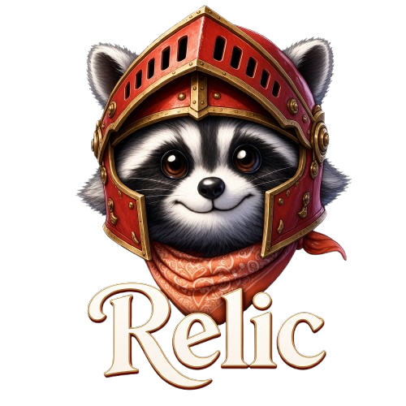
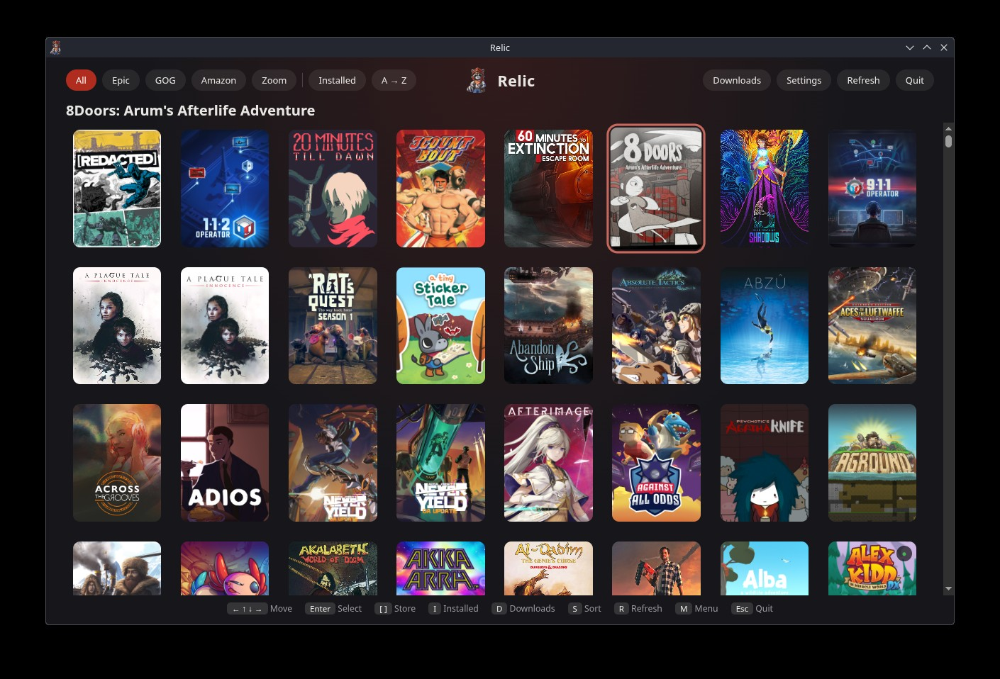
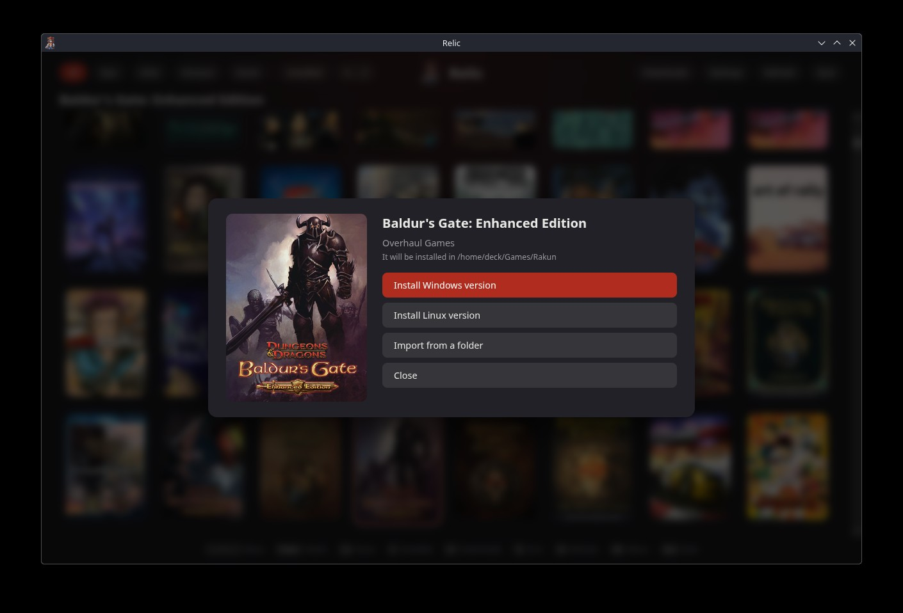

<p align="center">
  
</p>

<p align="center"><a href="README.md">English</a></p>

**Tu biblioteca de juegos, hecha para el mando.** Relic es un cliente a pantalla completa para tus juegos de Epic, GOG, Amazon y Zoom: eliges uno, pulsas instalar y aparece en Steam. Está pensado para el modo juego de la Steam Deck, y también funciona como una ventana normal en cualquier escritorio Linux.

> **Un nuevo comienzo.** Relic 1.0 no es una actualización del Relic que quizá conoces (hasta la 0.6.x, el launcher de escritorio basado en Heroic). Conserva el nombre pero empieza de cero: un cliente de estilo consola que habla con [rakun](https://github.com/FranjeGueje/rakun/), el motor que hace el trabajo con las tiendas. El Relic antiguo sigue aquí, intacto, en la rama [`legacy`](https://github.com/FranjeGueje/Relic/tree/legacy), pero no recibirá novedades.

<p align="center">
  
</p>

## Qué ofrece

- **Tu biblioteca** con carátulas, filtrada por tienda o por instalados, y ordenada en ambos sentidos
- **Instalar, actualizar, reparar y desinstalar**, eligiendo la versión de Windows o de Linux cuando el juego tiene las dos, o adoptar un juego que ya tienes en el disco
- **Una cola de descargas** que puedes pausar, reanudar y cancelar
- **Inicio de sesión dentro de la app**: sin navegador y sin copiar códigos
- **Un solo archivo**: el AppImage lleva rakun dentro, así que no hay nada más que instalar, y se detiene al salir
- **Si vienes del Relic antiguo**: en el primer arranque mueve tus ajustes, sesiones y juegos instalados a rakun, y borra `~/.config/relic` al terminar
- **Sin ensuciar**: no deja nada en `~/.config`. Solo se quedan los ficheros de rakun (tus sesiones, tu biblioteca y tus juegos) y las carátulas que Relic ha visto, en `~/.cache/relic/images` (300 MB como mucho), para que la biblioteca las muestre sin red
- **También con ratón**: cada panel tiene su botón de cerrar, y la barra se pliega en un ☰ en ventanas estrechas

Todavía no hay: categorías, favoritos ni búsqueda.

<p align="center">
  
</p>

## Instalación automática

Un solo comando lo instala y lo añade a Steam, con sus imágenes:

```bash
curl -sL https://raw.githubusercontent.com/FranjeGueje/Relic/master/scripts/install.sh | bash
```

Descarga la última release en `~/.local/bin/Relic` (borrando el antiguo `relic.AppImage`, si existe), comprueba su sha256 y te ofrece añadirlo a Steam con sus grids. Hay que cerrar o reiniciar Steam para ver las imágenes; el script te ofrece cerrarlo.

## Instalación

Descarga el `.AppImage` de las [releases](https://github.com/FranjeGueje/Relic/releases), hazlo ejecutable y lánzalo:

```bash
chmod +x relic-*.AppImage
./relic-*.AppImage            # añade --fullscreen para el modo juego
```

En una Steam Deck, añádelo a Steam como juego que no es de Steam. Inicia sesión en tus tiendas desde el menú (Select → Cuentas); la primera vez, Relic te ofrece descargar los programas auxiliares que necesita rakun.

¿Sin FUSE? Ejecútalo con `--appimage-extract-and-run`. Si tu sistema tiene desactivados los espacios de nombres de usuario, añade `--no-sandbox`.

## Controles

| Acción                      | Mando           | Teclado                  |
| --------------------------- | --------------- | ------------------------ |
| Moverse                     | cruceta / stick | flechas                  |
| Elegir / confirmar          | A (✕)           | Enter                    |
| Atrás / cerrar              | B (◯)           | Esc                      |
| Tienda anterior / siguiente | L1 / R1         | `[` / `]`                |
| Solo instalados             | X (□)           | `i`                      |
| Descargas                   | Y (△)           | `d`                      |
| Ordenar                     | R2              | `s`                      |
| Refrescar la biblioteca     | Start           | `r`                      |
| Menú                        | Select          | `m`                      |
| Salir (pregunta antes)      | B en la rejilla | `q`, o Esc en la rejilla |

## Compilarlo

Necesitas Node 24 y pnpm.

```bash
git clone https://github.com/FranjeGueje/Relic.git && cd Relic
scripts/init-ui.sh     # las pantallas vienen de la web de rakun, un submódulo de git
pnpm install
pnpm dev               # desarrollo; necesita un rakun en marcha (rakunctl start)
pnpm package           # dist/relic-<versión>-x64.AppImage (unos 100 MB)
```

`pnpm package` descarga la release de rakun que corresponde a las pantallas (comprobada con su `.sha256`); para usar tu propia compilación, define `RAKUN_TARBALL=ruta/a/rakun-<versión>-linux-x64.tar.gz`. `pnpm codecheck`, `pnpm lint`, `pnpm prettier` y `pnpm test` revisan el proyecto.

## Cómo encaja todo

Las pantallas son **la web de rakun**, incluida como submódulo `vendor/rakun`; Relic añade la ventana de Electron, el salir, el arrancar rakun y la ventana de inicio de sesión. Un cambio en una pantalla se hace en rakun, y Relic solo mueve el puntero del submódulo. Por dentro, la app habla con rakun por `127.0.0.1` desde el proceso principal, y la interfaz solo recibe una lista corta y fija de canales. Los detalles están en [AGENTS.md](AGENTS.md).

## Releases

GitHub Actions revisa cada push y cada pull request. Una release es una etiqueta `vX.Y.Z` en `master`: sube la versión en `package.json`, añade `## X.Y.Z — Título` a `CHANGELOG.md` (`scripts/release-notes.sh vX.Y.Z` lo comprueba), fusiona en `master` y luego `git tag -a vX.Y.Z && git push origin vX.Y.Z`. El workflow construye el AppImage con el rakun publicado y crea la release.

## Licencia

GPL-3.0-only. Relic desciende de [Heroic Games Launcher](https://github.com/Heroic-Games-Launcher/HeroicGamesLauncher) y del Relic anterior (rama `legacy`).
